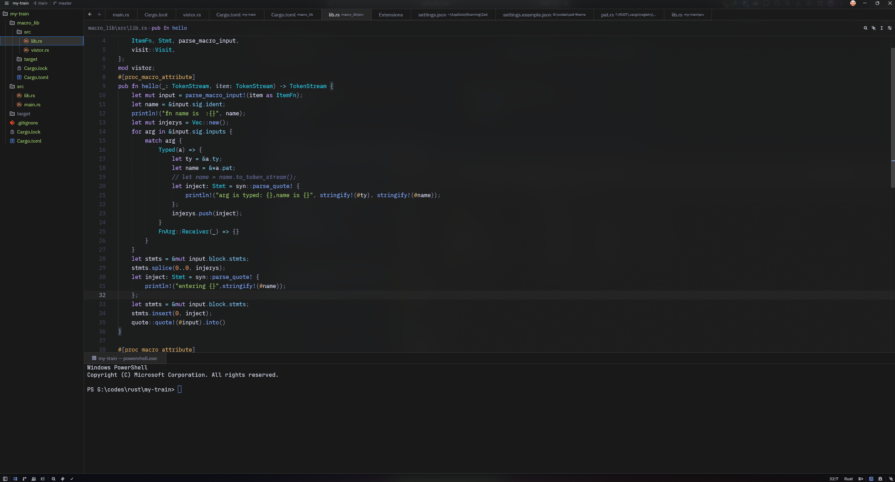
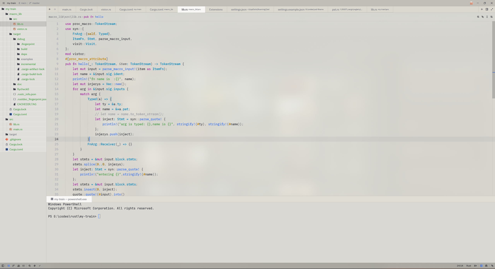

# io3

[English](README.md) | **简体中文**

一套现代化的 [Zed](https://zed.dev) 主题——黑白双色，背景带轻微毛玻璃模糊，配色以可读性优先。

## 预览

**io3 Dark**

**io3 Light**

## 特性

- **黑 / 白双色** —— `io3 Dark` 与 `io3 Light`，跟随系统外观自动切换
- **毛玻璃背景** —— 近乎不透明的窗口 + 系统级模糊：整体纯黑/纯白，只留一丝微透
- **可读性优先的配色** —— 深色基于 Tokyo Night、浅色基于 One Light 调优；类型名饱和醒目、参数名压暗斜体，Rust 宏使用独立颜色、与方法一眼区分
- **完整覆盖** —— 语法高亮、UI 边框、Git 状态色、诊断色、终端 ANSI 16 色、多人协作光标
- **弹出层不透明** —— hover 提示、补全、菜单始终清晰可读

## 安装

1. 把 `themes/io3.json` 复制到 Zed 主题目录：
   - Windows: `%USERPROFILE%\AppData\Roaming\Zed\themes\`
   - macOS / Linux: `~/.config/zed/themes/`
2. 重启 Zed，`Ctrl+K Ctrl+T` 打开主题选择器，选 **io3 Dark** 或 **io3 Light**
3. 可选：把 `settings.example.json` 合并进 `settings.json`，获得推荐字体（JetBrains Mono + Inter）与黑白自动切换

## 推荐字体

免费、支持连字：**JetBrains Mono**（代码）、**Inter**（UI）。中文友好备选：Maple Mono。
